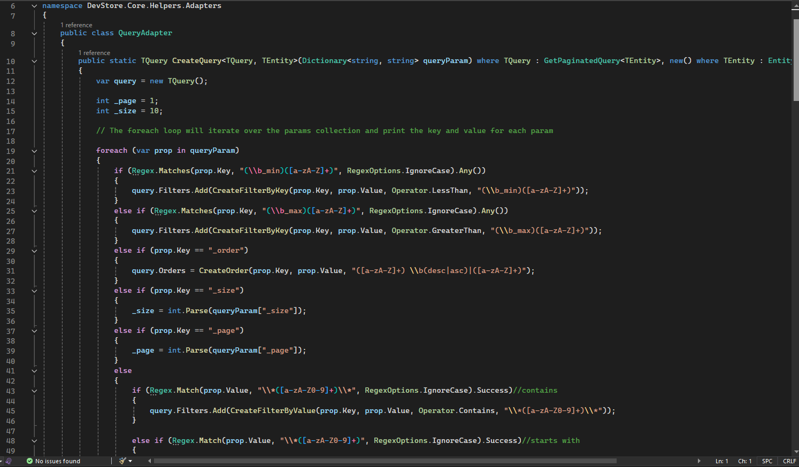
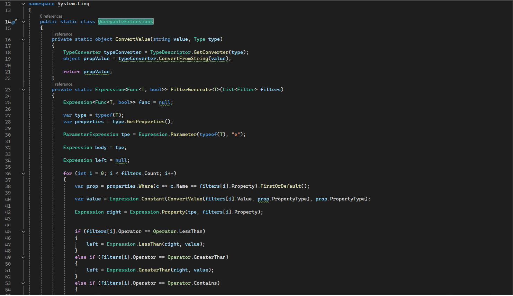
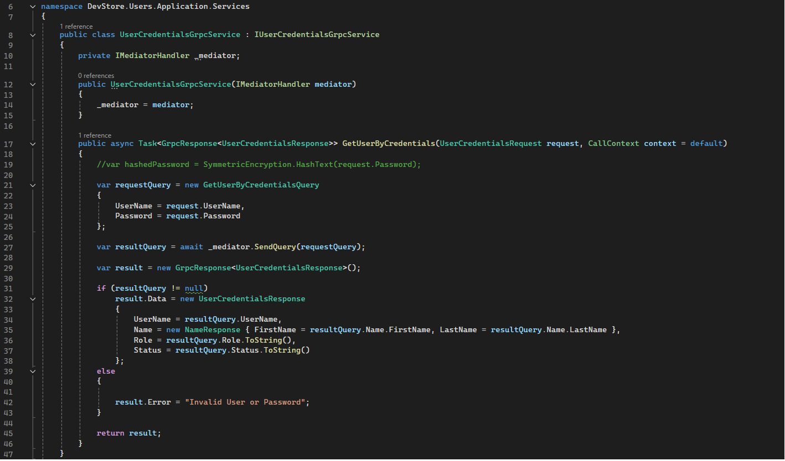
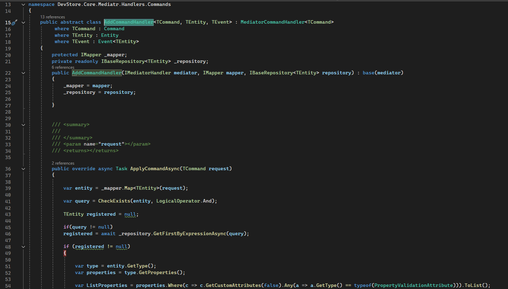
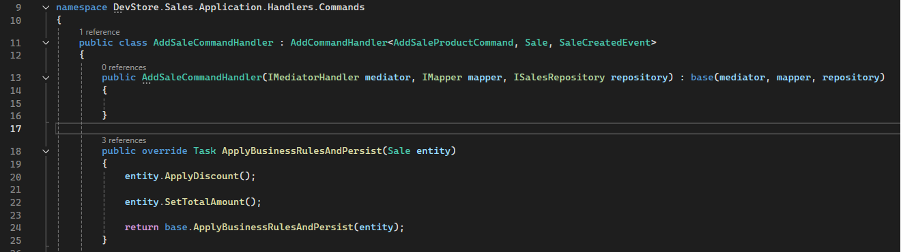

[Back to README](../readme.md)

## Project Implementation

### Dynamic filter implementation

A dynamic filter class was implemented to generate properties and conditions to be used by the class that implements QueryableExtensions.

The QueryableExtensions class generates a lambda expression for the properties of the entity type classes.

### Grpc connection

For user logins, a connection between user-api and auth-api was implemented using the [protobuf-net.Grpc](https://github.com/protobuf-net/protobuf-net.Grpc) nuget.

### Generics Handlers implementation

By using generic handlers class it is possible to separate the complex logic of the handlers from the implementation of business rule execution and keeps the code clear.

Generic addCommandHandler

SaleCommandHandler

### Tech Debt

 - Enable authorization for controllers
 - Create worker and implement Pub and sub RabbitMQ
 - Create front end